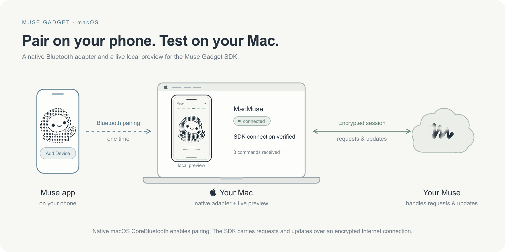

# Muse Gadget for macOS



An experimental CoreBluetooth adapter for the [Muse Gadget SDK](https://github.com/facebookincubator/muse-gadget-sdk), plus a restricted display gadget and live browser preview. Pair a Mac with the Muse phone app, receive a character and caption, and test explicitly registered display commands before moving onto hardware.

This is a community project, not an official Meta or Xteink product. The adapter reuses upstream pairing v5, encrypted Noise sessions, device-token rotation and reconnect behavior. It replaces the Linux BlueZ peripheral with a small native Swift process. No shell, arbitrary file, or firmware-update commands are registered.

## Why this exists

The pinned SDK’s desktop pairing implementation uses Linux BlueZ, so it cannot
advertise a gadget on macOS without a different Bluetooth transport. This adapter
provides that transport through native CoreBluetooth, while leaving pairing and
the encrypted Muse session in the upstream SDK.

Our first Mac attempt reported **advertising**, but Muse on the iPhone found no
device. LightBlue could see the peripheral and its SDK service; the combined
name/service advertisement was not exposing the complete discovery name.
Switching to **name-only advertising** made the gadget discoverable and allowed
pairing. The service remains available after connecting.

The [Bluetooth debugging guide](docs/bluetooth-debugging.md) walks through that
failure and separates discovery, pairing, authenticated registration, and actual
caption/avatar delivery. Those stages are the reason for the preview’s diagnostics.

Phone pairing, authenticated registration, and real caption/avatar delivery have
been observed on an Apple Silicon Mac with Muse for iOS. This is an experimental
adapter, not a compatibility guarantee across app/OS versions or a hardware test.

## Requirements

- macOS with Bluetooth LE, Python 3.11+, Xcode Command Line Tools (`xcode-select --install`).
- [uv](https://docs.astral.sh/uv/) or pip, and Internet access for dependencies.
- Muse on your phone, Developer mode enabled, and your own [SDK token](https://gadgets.muse.ai/settings/sdk-tokens). Review the [Gadget SDK Terms](https://gadgets.muse.ai/sdk-terms).

## Install and pair

From this checkout:

```sh
uv venv
uv pip install -e '.[test]'
scripts/build-native.sh
cp .env.example .env
chmod 600 .env
```

Edit `.env` locally and put your token inside the empty quotes. Do not put the token in a shell command or chat. Then:

```sh
.venv/bin/muse-mac pair
```

Allow Bluetooth if macOS asks. The browser opens a live preview and shows the randomly generated gadget name. On your phone, use **Muse → Settings → Devices → Add Device**, select that exact `MuseGadgetXXXXXX` name, accept the community-device prompt, then choose **Use current connection**. The Mac uses its existing network; it does not retain the phone's Wi-Fi credentials.

The pairing window closes after ten minutes. Successful pairing continues into a live Muse session in the same process. The preview says **connected** only after the server acknowledges command registration. If already paired, start it with:

```sh
.venv/bin/muse-mac run
```

If Muse finds no devices, follow the [LightBlue checks](docs/bluetooth-debugging.md#muse-finds-no-nearby-devices).

To view the empty interface without credentials or Bluetooth:

```sh
.venv/bin/muse-mac preview
```

`--name NAME` sets the friendly name shown in Muse and the preview (default **MacMuse**); it keeps the app-compatible `MuseGadgetXXXXXX` discovery identity. `--env-file PATH`, `--state-dir PATH`, `--native-app PATH`, and `--no-browser` support different environments. Paths are safe command arguments; tokens are not. Press Ctrl-C to stop. There is no persistent background service installed.

## Verify actual delivery

Use `muse-mac run --request-avatar` to ask your paired Muse once, after registration, to send its existing character and a caption. These opt-in requests send chat messages to Muse. A request acknowledgement does not prove delivery; check the received command count and visible content.

Ask your Muse:

> On my MacMuse gadget, call display.set_caption with text "SDK connection verified". Then call display.get_status and report the result. Send your character through display.draw_url as a public HTTPS image. Tell me if any command fails.

An accepted command increments the preview's received count. A visible exact caption verifies delivery. A character verifies the separate download and rendering path. Failed image updates preserve the previous character. Images are fitted inside a 480×480 canvas and dithered to black and white, preserving PNG alpha transparency. An opaque source image retains its background; ask Muse for a transparent PNG to show only the avatar.

## Test commands

| Command | Required parameters | Behavior |
| --- | --- | --- |
| `display.set_caption` | `text` | Display plain text, up to 240 UTF-8 bytes |
| `display.draw_url` | `url` | Download and render a public HTTPS image, up to 5 MB |
| `display.get_status` | none | Connection, accepted-command count, last command; no private content |

These are sample commands for exercising the transport. Product-specific
features and UIs belong in separate applications. The hero illustrates a custom phone-style UI. The included default preview shows
connection diagnostics, an image, and a caption. An application can use
`muse_mac.host.Application` to supply its own state factory, executor, explicit
command registry, preview HTML, read-only routes, and post-registration callback.
The adapter continues to own Bluetooth pairing and the upstream encrypted session.

```python
from muse_mac.host import Application, main

profile = Application(
    state_factory=MyState,
    executor_factory=MyExecutor,
    command_specs=MY_COMMANDS,
    preview_path="my-preview.html",
)
main(profile)
```

`MyExecutor.run(command, params, timeout_ms=None)` returns the SDK's command
result. The state supplies a lock, a data mapping, optional PNG image bytes,
`set(**values)`, and `snapshot()`. Register only the commands your application
needs. Custom applications are trusted local code, not plugins loaded remotely.

## Privacy and security

- `.env` is ignored, must be owner-only, and is parsed as data rather than executed. Its token is never exported to the environment or supplied as a process argument.
- Pairing state lives outside the checkout, by default in `~/Library/Application Support/MuseMacGadget`, with a mode-0700 directory and mode-0600 JSON files. It contains device access/refresh tokens; never share it.
- The Swift process only transports BLE packets. SDK credentials stay in the Python pairing/session code; upstream logs are suppressed to avoid account identifiers or signed image URLs appearing in output.
- The preview is read-only and binds to loopback on a random port. It exposes displayed content to processes on the same Mac. It never returns SDK or device credentials. Display content and images are held in memory, not saved to the repository.
- Image URLs must use HTTPS and resolve to public addresses; redirects are checked too. This is not a sandbox against a malicious paired Muse or DNS operator.
- Community pairing has no manufacturer attestation. Pair your own trusted gadget locally. The private display content is separate from reusable source.

## Extend it

`MacTransport` implements the SDK's transport interface (`send_packets`, `mtu`, `disconnect`); the pairing cryptography stays upstream. `DisplayExecutor` supplies the command implementation, and `COMMANDS` supplies the advertised registry. Add a schema and handler there, validate the payload before mutation, and add tests. Restart the session to register changes. Keep privileged commands opt-in in any forks.

The SDK currently registers the desktop device with its upstream `linux` / `homehub` compatibility metadata. The local pairing firmware version identifies the macOS adapter. Remote OTA is not advertised. A future upstream platform-neutral device description can replace this compatibility choice.

## Development

```sh
.venv/bin/python -m pytest
scripts/build-native.sh
```

The SDK dependency is pinned to commit `b1a3822995a51c0203cd1f3d72c1c656b8c3e620`. Install it independently if you want to run its complete test suite. No pairing or credentials are needed for tests.

Before publishing:

```sh
python3 scripts/check-secrets.py --include-untracked
gitleaks git --redact --no-banner
```

The custom checker scans public candidate files and reachable/reflog history, including commit metadata. Supply `--private-file PATH` for each local token or pairing file to also check exact credential values and common encodings without printing matches. Gitleaks adds general credential-pattern detection. Neither check makes private images or pairing files safe to publish.

## License

Apache 2.0. See [LICENSE](LICENSE) and [NOTICE](NOTICE). Upstream SDK copyright and license notices remain with the installed dependency. The README hero’s Jolly-derived artwork and product marks are outside this project’s Apache grant; see NOTICE. Muse's SDK token terms are separate from this source license.
